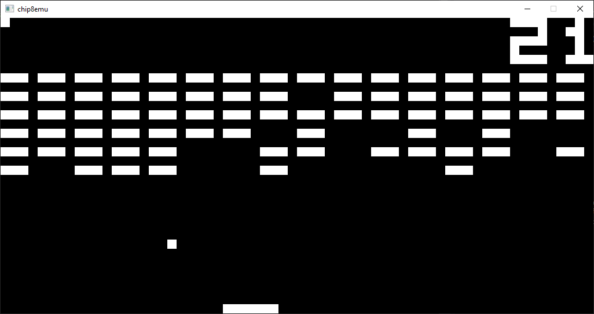
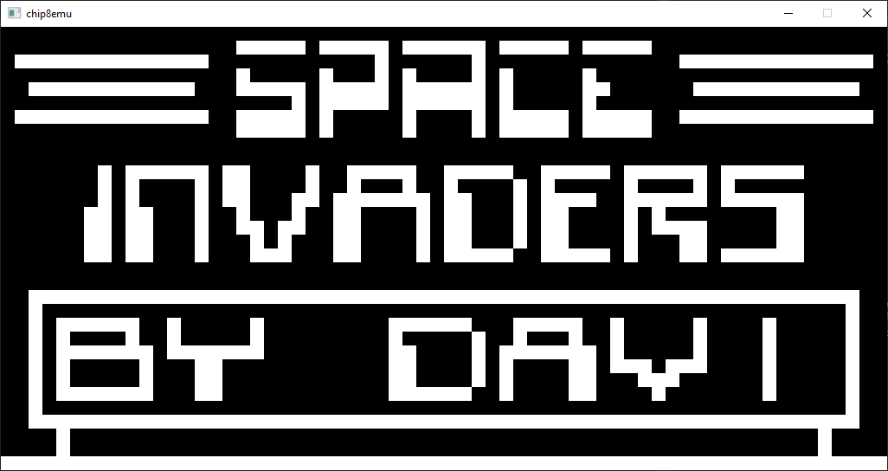
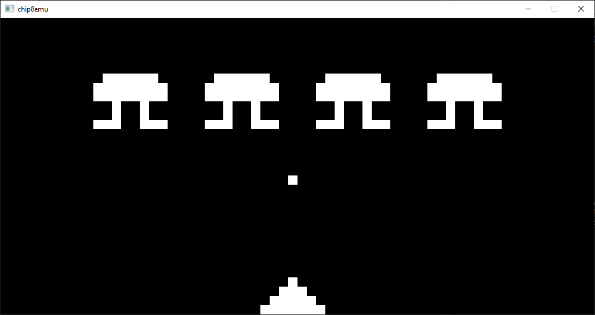

# CHIP-8 Emulator 

- Configurable with a simple yaml file. (check example config)
- Code Generated Sound
- Function pointers for most instructions.
- Included are some ROMs that are under the public domain.

The following links helped me, when programming this emulator:
- https://en.wikipedia.org/wiki/CHIP-8
- http://www.multigesture.net/articles/how-to-write-an-emulator-chip-8-interpreter/

Some images:

ROM: BRIX

ROM: INVADERS
